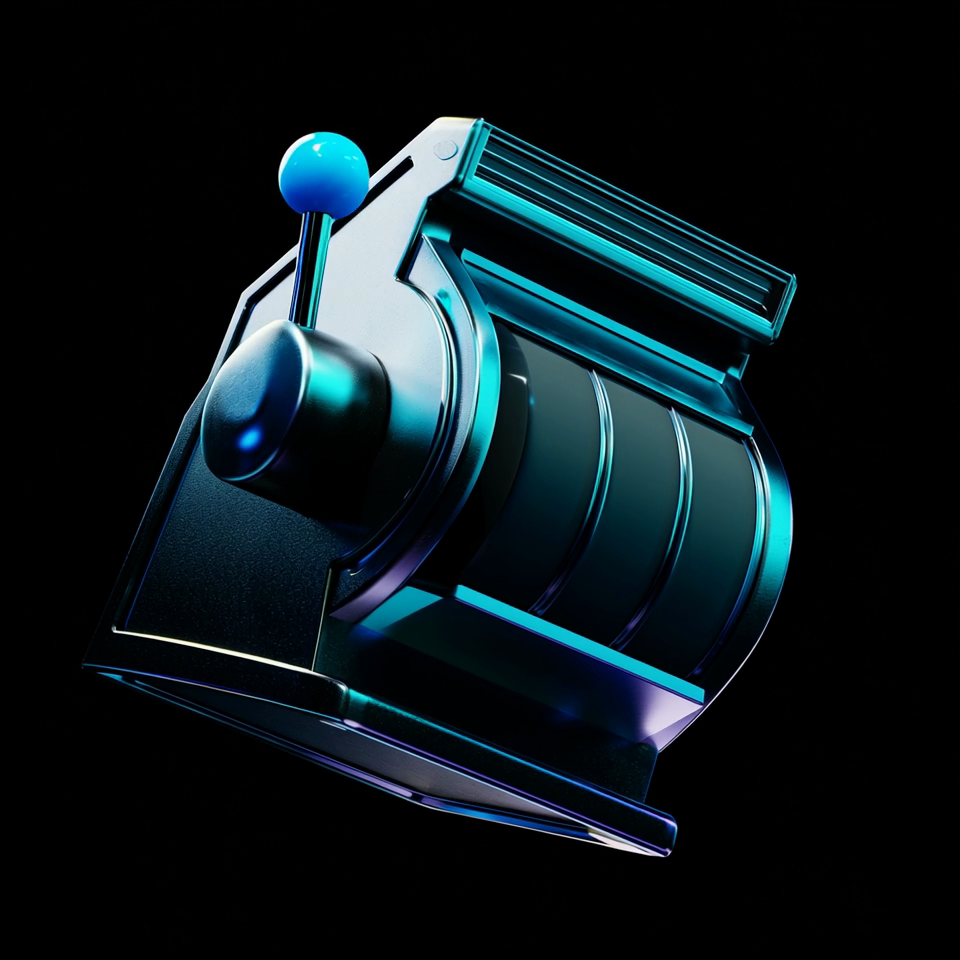
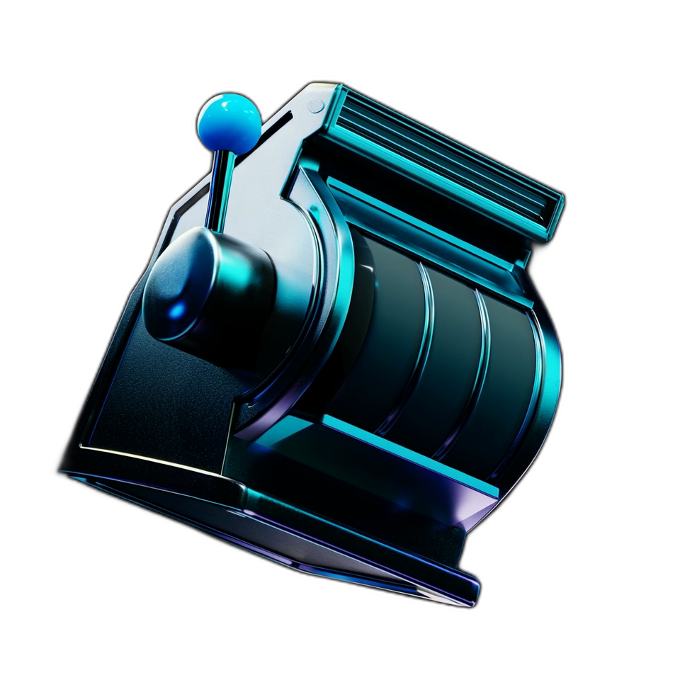
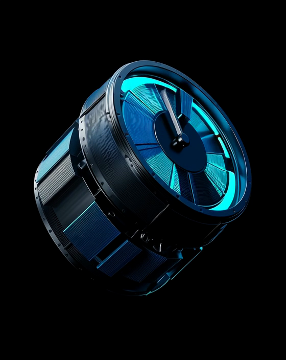
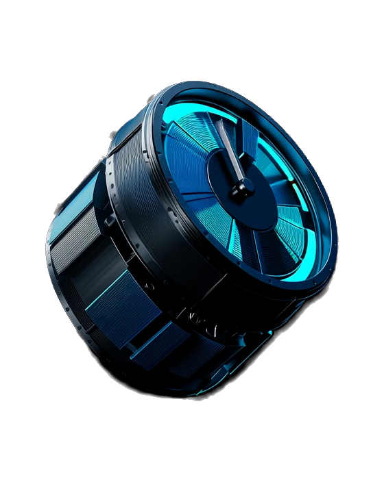
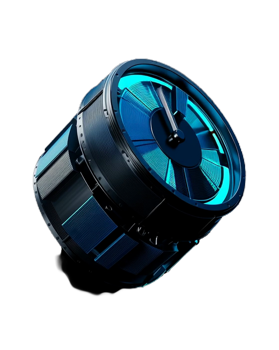
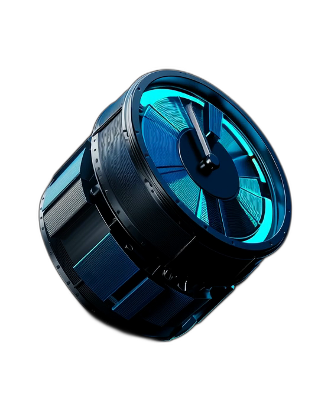
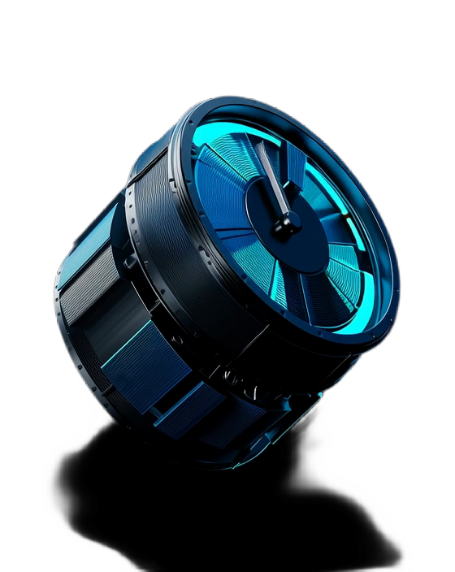
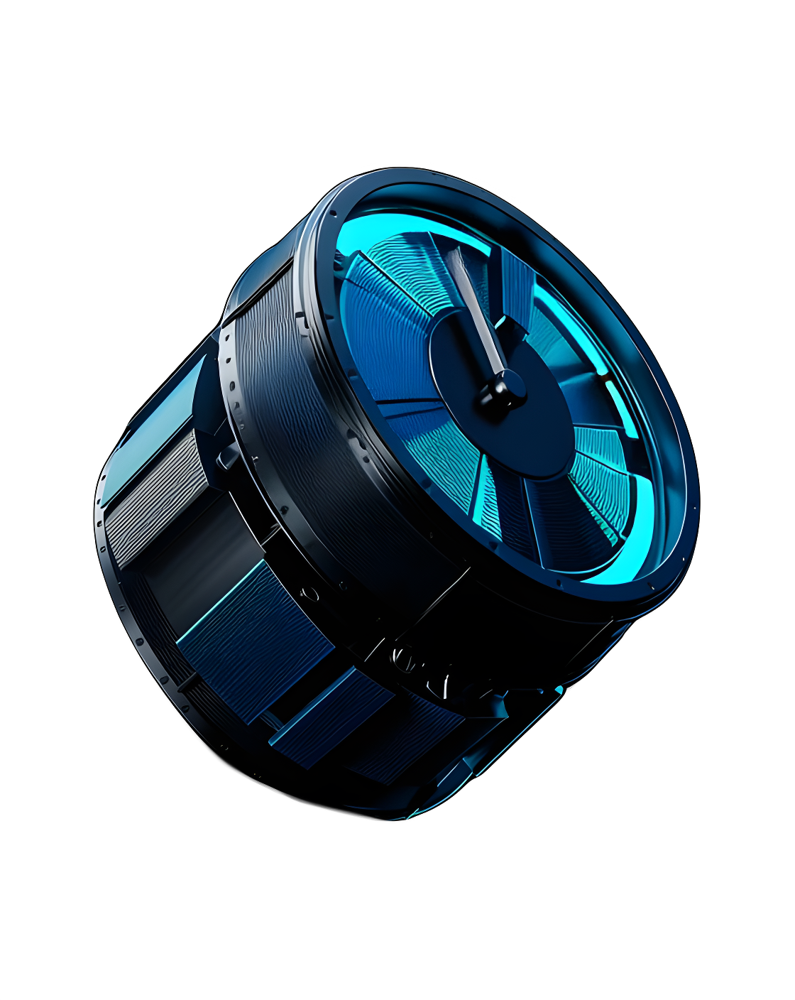

# replicate-tools

Batch background removal and upscaling for 121 video frames using Replicate models. Written in Rust with async concurrency (10 workers).

> [!TIP]
> When using Midjourney, I recommend generating upscaled/HD videos first and then removing the background.

> [!INFO]
> The assets used in the examples were from [junhoyeo/tokscale](https://github.com/junhoyeo/tokscale).


## Usage

```bash
cargo run --release <output-dir> <version> [input-dir] [extra-json]
```

- `input-dir` defaults to `frames`
- `extra-json` merges into input, e.g. `'{"scale":2}'`
- Skips already-processed frames automatically

## Background Removal — Model Comparison

Slot Machine — Frame 60 of 121 (`frame_0060.png`, 960×960):

| Original | cjwbw/rembg |
|:---:|:---:|
|  |  |

Frame 60 of 121 (`frame_0060.png`, 560×704):
| Original | lucataco/remove-bg | smoretalk/rembg-enhance | cjwbw/rembg | pollinations/modnet |
|:---:|:---:|:---:|:---:|:---:|
|  |  |  |  |  |
**Verdict:** **`cjwbw/rembg`** — cleanest shadow removal with best edge preservation.

## 2× Upscaling — Model Comparison

Same frame after `cjwbw/rembg` → 2× upscale (1120×1408):
| cjwbw/rembg (source) | daanelson/real-esrgan-a100 | lucataco/real-esrgan | cjwbw/real-esrgan |
|:---:|:---:|:---:|:---:|
|  |  |  |  |

## Models

### Background Removal

| Model | Version | Speed |
|-------|---------|-------|
| `lucataco/remove-bg` | `95fcc2a2...` | Fast |
| `smoretalk/rembg-enhance` | `4067ee2a...` | Slow |
| `cjwbw/rembg` | `fb8af171...` | Medium |
| `pollinations/modnet` | `da7d45f3...` | Fastest |

### Upscaling (2×)

| Model | Version | Speed | Output Size |
|-------|---------|-------|-------------|
| `daanelson/real-esrgan-a100` | `f94d7ed4...` | Fastest | 125M |
| `lucataco/real-esrgan` | `3febd193...` | Medium | 125M |
| `cjwbw/real-esrgan` | `d0ee3d70...` | Slow | 96M |
